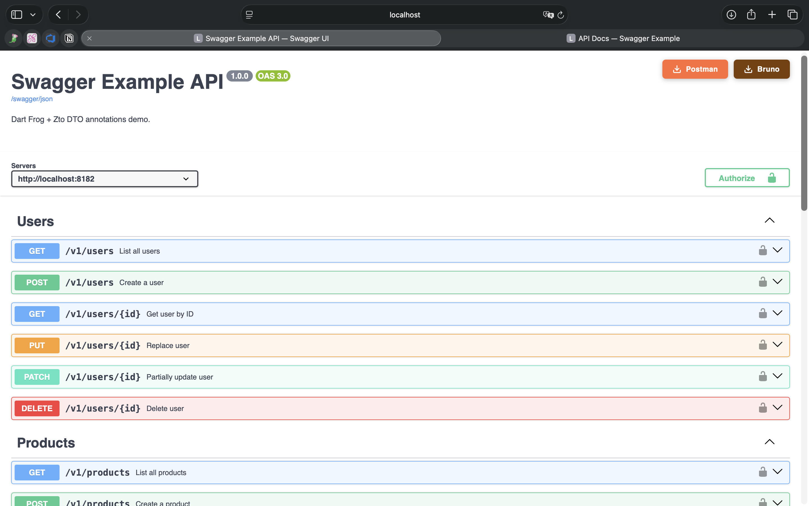
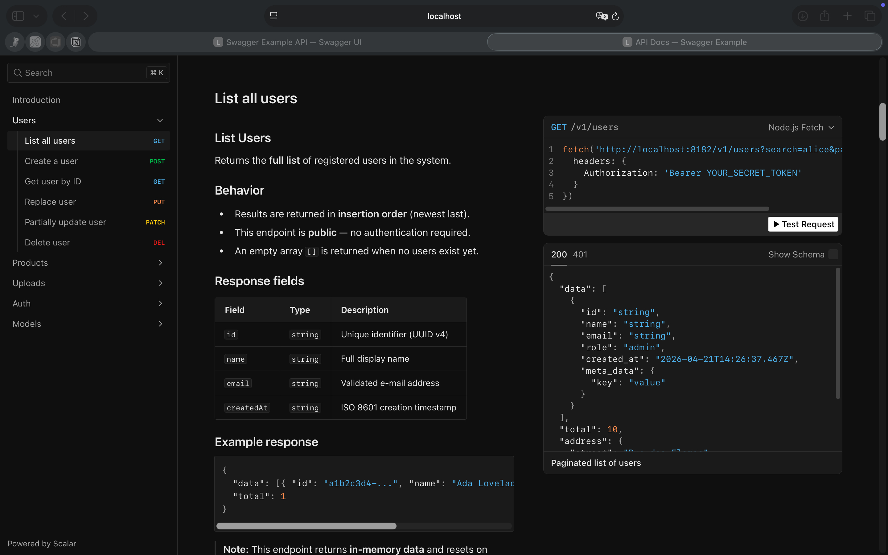

# dart_frog_open_api

OpenAPI 3.0 documentation generator for [Dart Frog](https://dartfrog.vgv.dev/) — gera Swagger UI ao vivo, Scalar UI, e coleções exportáveis (Postman / Bruno) direto das suas rotas.

**Zero anotações nos handlers. Zero spec manual. Configure uma vez, suba junto com o servidor.**

### Swagger UI

Interface clássica com botões de download integrados para Postman e Bruno.
Sirva em qualquer rota usando `openApi.swaggerUiHandler()`:

```dart
// routes/swagger/index.dart
FutureOr<Response> onRequest(RequestContext context) =>
    openApi.swaggerUiHandler()(context);
```



---

### Scalar UI

Interface moderna com painel "Try it" ao vivo, navegação lateral e suporte a environments.
Sirva em qualquer rota usando `openApi.scalarUiHandler()`:

```dart
// routes/scalar/index.dart
FutureOr<Response> onRequest(RequestContext context) =>
    openApi.scalarUiHandler()(context);
```



---

## Índice

- [Funcionalidades](#funcionalidades)
- [Instalação](#instalação)
- [Início rápido](#início-rápido)
- [Exemplo completo](#exemplo-completo)
- [Documentando rotas](#documentando-rotas)
  - [API fluente](#api-fluente-recomendada)
  - [Construtores diretos](#construtores-diretos)
- [Schemas com Zto](#schemas-com-zto)
- [Parâmetros](#parâmetros)
- [Segurança](#segurança)
  - [SecurityConfig](#securityconfig-referência)
  - [Esquemas de autenticação](#esquemas-de-autenticação)
- [Upload de arquivos](#upload-de-arquivos)
- [Scalar UI](#scalar-ui)
- [Exportar coleções](#exportar-coleções)
  - [Postman](#postman)
  - [Bruno](#bruno)
- [Excluir rotas da spec](#excluir-rotas-da-spec)
- [Referência completa](#referência-completa)
- [Rodando o exemplo](#rodando-o-exemplo)

---

## Funcionalidades

| | |
|---|---|
| ✅ | Auto-descobre rotas da pasta `routes/` |
| ✅ | Swagger UI e Scalar UI servidos pelo próprio servidor |
| ✅ | JSON da spec OpenAPI 3.0 |
| ✅ | Download de coleção Postman v2.1 (com scripts de teste) |
| ✅ | Download de coleção Bruno (ZIP com `.bru` por rota×método) |
| ✅ | Schemas de DTO automáticos via [Zto](https://pub.dev/packages/zto) |
| ✅ | Query / header / path parameters |
| ✅ | Headers de resposta documentados |
| ✅ | Environments para o Scalar "Try it" |
| ✅ | API fluente ou construtores diretos |
| 🔒 | **Seguro por padrão** — retorna 404 até você habilitar explicitamente |

---

## Instalação

```yaml
# pubspec.yaml
dependencies:
  dart_frog_open_api:
    path: ../dart_frog_open_api   # ajuste conforme seu monorepo
```

> O pacote depende do [Zto](https://pub.dev/packages/zto) para geração de schemas de DTO.
> Adicione-o também se ainda não estiver no projeto.

---

## Início rápido

### 1. Inicializar em `main.dart`

```dart
// main.dart
import 'dart:io';
import 'package:dart_frog/dart_frog.dart';
import 'package:dart_frog_open_api/dart_frog_open_api.dart';
import 'open_api/config.dart';   // importa direto da raiz do projeto

late final DartFrogOpenApi openApi;

Future<void> init(InternetAddress ip, int port) async {
  openApi = DartFrogOpenApi(config: openApiConfig);
}

Future<HttpServer> run(Handler handler, InternetAddress ip, int port) =>
    serve(handler, ip, port);
```

### 2. Criar as rotas do Swagger

**`routes/swagger/index.dart`** — UI visual
```dart
import 'dart:async';
import 'package:dart_frog/dart_frog.dart';
import '../../main.dart';    // importa a instância openApi

FutureOr<Response> onRequest(RequestContext context) =>
    openApi.swaggerUiHandler()(context);
```

**`routes/swagger/json.dart`** — spec JSON (OpenAPI 3.0)
```dart
import 'dart:async';
import 'package:dart_frog/dart_frog.dart';
import '../../main.dart';

FutureOr<Response> onRequest(RequestContext context) =>
    openApi.openApiJsonHandler()(context);
```

### 3. Criar a config

A pasta `open_api/` fica na **raiz do projeto** (ao lado de `main.dart` e `routes/`), não dentro de `lib/`. Isso é necessário para que os arquivos de rota possam importá-la com caminhos relativos simples.

```dart
// open_api/config.dart
import 'dart:io';
import 'package:dart_frog_open_api/dart_frog_open_api.dart';

final openApiConfig = OpenApiConfig(
  info: OpenApiInfo(
    title: 'Minha API',
    description: 'Documentação gerada com dart_frog_open_api.',
    version: '1.0.0',
    servers: ['http://localhost:8080'],
  ),
  pathSchemas: apiPathSchemas,   // suas rotas documentadas
  specUrl: '/swagger/json',
  security: SecurityConfig(
    enabled: Platform.environment['OPEN_API_ENABLED'] == 'true',
  ),
);
```

### 4. Rodar

```bash
dart pub get
dart run build_runner build --delete-conflicting-outputs
OPEN_API_ENABLED=true dart_frog dev
```

Acesse `http://localhost:8080/swagger` e a UI estará no ar:


---

## Exemplo completo

A pasta [`swagger_example/`](swagger_example/) contém uma API completa com usuários, produtos, uploads e autenticação.

### Estrutura do projeto

```
my_api/
├── main.dart                          # inicializa DartFrogOpenApi
├── pubspec.yaml
├── open_api/                          # ← raiz do projeto, NÃO dentro de lib/
│   ├── config.dart                    # OpenApiConfig principal
│   ├── paths.dart                     # mapa de PathSchema por rota
│   └── security_refs.dart            # definições de esquemas de segurança
├── routes/
│   ├── swagger/
│   │   ├── index.dart                 # GET /swagger      → Swagger UI
│   │   └── json.dart                  # GET /swagger/json → spec JSON
│   ├── scalar/
│   │   └── index.dart                 # GET /scalar       → Scalar UI
│   └── v1/
│       ├── _middleware.dart           # validação JWT para todo /v1
│       ├── auth/
│       │   └── login.dart             # POST /v1/auth/login (público)
│       ├── users/
│       │   ├── index.dart             # GET/POST /v1/users
│       │   └── [id].dart              # GET/PUT/PATCH/DELETE /v1/users/{id}
│       ├── products/
│       │   ├── index.dart             # GET/POST /v1/products
│       │   └── [id].dart              # GET/DELETE /v1/products/{id}
│       └── uploads/
│           └── index.dart             # POST /v1/uploads
└── lib/
    └── dtos/
        ├── user_dto.dart             # CreateUserDto, UserResponseDto, etc.
        └── product_dto.dart          # CreateProductDto, etc.
```

> **Por que fora de `lib/`?** Arquivos de rota em `routes/` não conseguem importar pacotes internos via `package:` — apenas via caminhos relativos. Como os docs de cada rota precisam importar `open_api/security_refs.dart` e outros, a pasta precisa estar acessível com `../open_api/...` a partir de `routes/`.

### `open_api/security_refs.dart`

Centralize suas referências de segurança para reutilizá-las nas rotas:

```dart
import 'package:dart_frog_open_api/dart_frog_open_api.dart';

final openapiBearer = OpenApiSecurity.bearer();
final openapiApiKey = OpenApiSecurity.apiKeyHeader(header: 'X-API-Key');

final openapiDeclaredSecuritySchemes = [
  openapiBearer,
  openapiApiKey,
];
```

### `open_api/config.dart`

```dart
import 'dart:io';
import 'package:dart_frog_open_api/dart_frog_open_api.dart';
import 'paths.dart';
import 'security_refs.dart';

final openApiConfig = OpenApiConfig(
  info: OpenApiInfo(
    title: 'Minha API',
    description: '''
## Bem-vindo

Esta é a documentação completa da API.
Utilize o botão **Authorize** para autenticar com Bearer Token.
''',
    version: '1.0.0',
    servers: ['http://localhost:8080'],
  ),
  pathSchemas: apiPathSchemas,
  specUrl: '/swagger/json',
  declaredSecuritySchemes: openapiDeclaredSecuritySchemes,
  globalSecurity: [openapiBearer.componentKey],   // Bearer obrigatório globalmente
  security: SecurityConfig(
    enabled: Platform.environment['OPEN_API_ENABLED'] == 'true',
    corsOrigins: ['http://localhost:3000'],
    logAccess: true,
  ),
  // Environments para o "Try it" do Scalar
  scalarEnvironments: [
    ScalarEnvironment(
      name: 'local',
      variables: {
        'token':  ScalarVariable(defaultValue: '', description: 'JWT do login'),
        'userId': ScalarVariable(defaultValue: 'u001'),
      },
    ),
  ],
  scalarActiveEnvironment: 'local',
);
```

### `open_api/paths.dart`

```dart
import 'package:dart_frog_open_api/dart_frog_open_api.dart';
import 'security_refs.dart';

// Schemas gerados pelo build_runner (ficam em lib/dtos/)
import '../lib/dtos/user_dto.g.dart';
import '../lib/dtos/product_dto.g.dart';

final apiPathSchemas = <String, PathSchema>{
  '/v1/auth/login': v1AuthLoginApiDoc,
  '/v1/users':      v1UsersApiDoc,
  '/v1/users/{id}': v1UsersIdApiDoc,
};
```

---

## Documentando rotas

### API fluente (recomendada)

Use `Api.path()` para construir a documentação de forma encadeada. Cada arquivo de rota pode ter seu próprio objeto de documentação co-localizado:

```dart
// routes/v1/users/index.dart
import 'package:dart_frog_open_api/dart_frog_open_api.dart';
import '../../../lib/dtos/user_dto.g.dart';
import '../../../open_api/security_refs.dart';   // raiz do projeto, não lib/

// Documentação da rota — fica junto ao handler
final v1UsersApiDoc = Api.path()
    .get((op) => op
        .summary('Listar usuários')
        .description('''
Retorna lista paginada de usuários.

Suporta filtro por nome via `search`.
''')
        .tag('Users')
        .security([openapiBearer.componentKey])
        .query('search', ParamType.string, description: 'Filtro por nome')
        .query('page',   ParamType.integer, example: 1)
        .query('limit',  ParamType.integer, example: 20)
        .returns(200,
            schema: $UserListResponseDtoSchema,
            description: 'Lista paginada')
        .responseHeader(200, 'X-Total-Count', ParamType.integer,
            description: 'Total de registros'))
    .post((op) => op
        .summary('Criar usuário')
        .tag('Users')
        .header('X-Request-Id', ParamType.string,
            format: 'uuid', description: 'Chave de idempotência')
        .body($CreateUserDtoSchema)
        .returns(201, schema: $UserResponseDtoSchema)
        .responseHeader(201, 'Location', ParamType.string,
            description: 'URL do novo recurso')
        .postman('''
          pm.test("Status é 201", () => pm.response.to.have.status(201));
          const body = pm.response.json();
          if (body.id) pm.environment.set("userId", body.id);
        ''')
        .bruno('''
          test("Status é 201", () => expect(res.getStatus()).to.equal(201));
          if (res.getBody().id) bru.setEnvVar("userId", res.getBody().id);
        '''))
    .build();

// Handler Dart Frog normal — sem anotação nenhuma
Future<Response> onRequest(RequestContext context) async {
  return switch (context.request.method) {
    HttpMethod.get  => _listUsers(context),
    HttpMethod.post => _createUser(context),
    _               => Response(statusCode: 405),
  };
}
```

**Rota com path parameter:**

```dart
// routes/v1/users/[id].dart
final v1UsersIdApiDoc = Api.path()
    .param('id', ParamType.string,
        description: 'Identificador do usuário', example: 'u001')
    .get((op) => op
        .summary('Buscar usuário por ID')
        .tag('Users')
        .returns(200, schema: $UserResponseDtoSchema)
        .returns(404, description: 'Não encontrado'))
    .put((op) => op
        .summary('Substituir usuário')
        .tag('Users')
        .body($UpdateUserDtoSchema)
        .returns(200, schema: $UserResponseDtoSchema))
    .patch((op) => op
        .summary('Atualização parcial')
        .tag('Users')
        .body($UpdateUserDtoSchema, required: false)   // body opcional
        .returns(200, schema: $UserResponseDtoSchema))
    .delete((op) => op
        .summary('Remover usuário')
        .tag('Users')
        .returns(204, description: 'Removido com sucesso'))
    .build();
```

**Rota pública (sem autenticação):**

```dart
final v1AuthLoginApiDoc = Api.path()
    .post((op) => op
        .summary('Login')
        .tag('Auth')
        .public()                          // sobrescreve globalSecurity → sem auth
        .body($LoginRequestDtoSchema)
        .returns(200, schema: $LoginResponseDtoSchema)
        .postman('''
          if (pm.response.code === 200) {
            pm.environment.set("token", pm.response.json().token);
          }
        '''))
    .build();
```

#### Referência dos métodos do `OperationBuilder`

| Método | Descrição |
|--------|-----------|
| `.summary(String)` | Título curto da operação |
| `.description(String)` | Descrição em Markdown |
| `.tag(String)` / `.tags(List)` | Agrupa operações na UI |
| `.deprecated()` | Marca como depreciado |
| `.public()` | Sem autenticação (anula `globalSecurity`) |
| `.security(List<String>)` | Esquemas de segurança por nome |
| `.query(name, ParamType, {...})` | Adiciona query parameter |
| `.header(name, ParamType, {...})` | Adiciona header de request |
| `.body(ZtoSchema, {required, contentType})` | Define request body |
| `.returns(status, {schema, description})` | Define resposta por status code |
| `.responseHeader(status, name, ParamType, {...})` | Header de resposta |
| `.postman(script)` / `.postmanPre(script)` | Script de teste/pre-request para Postman |
| `.bruno(script)` / `.brunoPre(script)` | Script de teste/pre-request para Bruno |
| `.extension(key, value)` | Campo `x-*` customizado |

**`ParamType` disponíveis:** `string`, `integer`, `number`, `boolean`

---

### Construtores diretos

Alternativa à API fluente — útil quando você quer centralizar toda a documentação num único arquivo:

```dart
final v1UsersApiDoc = PathSchema(
  get: OperationSchema(
    summary: 'Listar usuários',
    tags: ['Users'],
    queryParameters: [
      const ParameterSchema(name: 'page',  type: 'integer', example: 1),
      const ParameterSchema(name: 'limit', type: 'integer', example: 20),
    ],
    responseSchemas: {200: OpenApiSchema.fromZto($UserListResponseDtoSchema)},
    responseHeaders: {
      200: [const ResponseHeaderSchema(name: 'X-Total-Count', type: 'integer')],
    },
  ),
  post: OperationSchema(
    summary: 'Criar usuário',
    tags: ['Users'],
    requestBodySchema: OpenApiSchema.fromZto($CreateUserDtoSchema),
    responseSchemas: {201: OpenApiSchema.fromZto($UserResponseDtoSchema)},
  ),
);

final v1UsersIdApiDoc = PathSchema(
  pathParameters: {
    'id': const ParameterSchema(
      name: 'id', type: 'string', example: 'u001',
    ),
  },
  get: OperationSchema(
    summary: 'Buscar usuário',
    tags: ['Users'],
    responseSchemas: {200: OpenApiSchema.fromZto($UserResponseDtoSchema)},
  ),
  delete: const OperationSchema(
    summary: 'Remover usuário',
    tags: ['Users'],
    responseSchemas: {204: null},   // null = sem response body
  ),
);
```

---

## Schemas com Zto

Anote seus DTOs com [Zto](https://pub.dev/packages/zto) e passe o schema gerado para `OpenApiSchema.fromZto()`. O pacote descobre DTOs aninhados automaticamente via `$ref`.

```dart
// lib/dtos/user_dto.dart
import 'package:zto/zto.dart';
part 'user_dto.g.dart';

@ZDto(description: 'Criar um novo usuário')
class CreateUserDto with ZtoDto<CreateUserDto> {
  @ZString(description: 'Nome completo', example: 'Alice Silva')
  @ZMinLength(2)
  final String name;

  @ZString(description: 'E-mail', example: 'alice@exemplo.com')
  @ZEmail()
  final String email;

  @ZEnum(values: ['admin', 'editor', 'viewer'])
  final String role;

  @ZInt(description: 'Idade em anos')
  @ZMin(18)
  @ZNullable()
  final int? age;

  // Objeto aninhado — gerado como $ref automático
  @ZNested()
  final AddressDto? address;
}

@ZDto()
class AddressDto with ZtoDto<AddressDto> {
  @ZString(example: 'Rua das Flores')
  final String street;

  @ZString(example: 'São Paulo')
  final String city;
}
```

Gere os schemas:

```bash
dart run build_runner build --delete-conflicting-outputs
```

Isso cria `$CreateUserDtoSchema`, `$AddressDto Schema`, etc. — use diretamente:

```dart
.body($CreateUserDtoSchema)
.returns(200, schema: $UserResponseDtoSchema)
```

O `dart_frog_open_api` percorre os `$ref` recursivamente e inclui todos os schemas dependentes em `components/schemas` automaticamente.

---

## Parâmetros

### Query parameters

```dart
.query('search', ParamType.string,
    description: 'Filtro por nome ou e-mail')
.query('page',   ParamType.integer, example: 1)
.query('limit',  ParamType.integer, example: 20)
.query('status', ParamType.string,
    values: ['active', 'inactive', 'pending'])   // enum
```

### Header parameters (request)

```dart
.header('X-Request-Id', ParamType.string,
    format: 'uuid', description: 'Chave de idempotência')
.header('X-Tenant-Id', ParamType.string,
    description: 'ID do tenant multi-tenant')
```

### Path parameters

```dart
Api.path()
    .param('id',      ParamType.string,  example: 'u001')
    .param('version', ParamType.integer, example: 2)
```

### Response headers

```dart
.responseHeader(200, 'X-Total-Count', ParamType.integer,
    description: 'Total de registros na coleção')
.responseHeader(201, 'Location', ParamType.string,
    description: 'URL do recurso criado',
    example: '/v1/users/u002')
```

---

## Segurança

Todos os endpoints de documentação retornam **404 Not Found** por padrão. Você precisa habilitar explicitamente via `SecurityConfig`.

```dart
// ❌ Padrão — docs retornam 404 (seguro para produção)
security: const SecurityConfig(),

// ✅ Habilitado — bom para desenvolvimento local
security: const SecurityConfig(enabled: true),

// ✅ Controlado por variável de ambiente (padrão recomendado)
security: SecurityConfig(
  enabled: Platform.environment['OPEN_API_ENABLED'] == 'true',
),

// ✅ Protegido por função guard — allowlist de IP, chave de admin, etc.
security: SecurityConfig(
  enabled: true,
  guard: (request) =>
      request.headers['X-Admin-Key'] == Platform.environment['ADMIN_KEY'],
),

// ✅ Com CORS para um front-end específico
security: SecurityConfig(
  enabled: true,
  corsOrigins: ['http://localhost:3000', 'https://meuapp.com'],
),
```

### `SecurityConfig` referência

| Campo | Tipo | Padrão | Descrição |
|-------|------|--------|-----------|
| `enabled` | `bool` | `false` | Master switch. `false` → todos os handlers retornam 404 |
| `guard` | `bool Function(Request)?` | `null` | Guard opcional. Retornar `false` → 403 Forbidden |
| `corsOrigins` | `List<String>?` | `null` | Origens CORS permitidas. `null` = sem header CORS. **Nunca emite `*`** |
| `securityHeaders` | `bool` | `true` | Adiciona `X-Frame-Options`, `X-Content-Type-Options`, `CSP`, etc. |
| `cacheTtl` | `Duration` | 5 min | TTL do cache da spec (anti-DoS) |
| `logAccess` | `bool` | `false` | Log de uma linha por acesso no stdout |

### Proteções embutidas

| Proteção | Detalhe |
|----------|---------|
| XSS | `specUrl` e `info.title` são escapados de HTML/JS antes da interpolação |
| CORS | Nunca emite wildcard `*` — apenas origens exatas da lista |
| Security headers | `Content-Security-Policy`, `X-Frame-Options: DENY`, `X-Content-Type-Options: nosniff`, `Referrer-Policy` |
| Path traversal | Symlinks dentro de `routes/` que apontem para fora do diretório são rejeitados |
| Cache anti-DoS | Spec cacheada com TTL configurável |
| Credenciais seguras | Arquivos de env do Bruno usam `<your-bearer-token>` como placeholder |
| Aviso HTTP | Warning no `stderr` quando `servers` usa HTTP fora de localhost |

---

### Esquemas de autenticação

#### Declarativo (recomendado)

```dart
// lib/open_api/security_refs.dart
final openapiBearer = OpenApiSecurity.bearer();
final openapiApiKey = OpenApiSecurity.apiKeyHeader(header: 'X-API-Key');
final openapiOAuth  = OpenApiSecurity.oauth2AuthorizationCode(
  name: 'OAuth2',
  authorizationUrl: 'https://auth.exemplo.com/authorize',
  tokenUrl: 'https://auth.exemplo.com/token',
  scopes: {'read:users': 'Leitura de usuários', 'write:users': 'Escrita'},
);

final openapiDeclaredSecuritySchemes = [
  openapiBearer,
  openapiApiKey,
  openapiOAuth,
];
```

```dart
// config.dart
final openApiConfig = OpenApiConfig(
  // ...
  declaredSecuritySchemes: openapiDeclaredSecuritySchemes,
  globalSecurity: [openapiBearer.componentKey],
);
```

Nas rotas, referencie pelo `componentKey`:

```dart
.security([openapiBearer.componentKey])         // só Bearer
.security([openapiApiKey.componentKey])          // só API Key
.security([openapiBearer.componentKey,
           openapiApiKey.componentKey])          // Bearer OU API Key
.public()                                        // sem autenticação
```

#### Esquemas disponíveis em `OpenApiSecurity`

| Factory | Descrição |
|---------|-----------|
| `OpenApiSecurity.bearer([name])` | JWT Bearer token |
| `OpenApiSecurity.basic([name])` | HTTP Basic Auth |
| `OpenApiSecurity.apiKeyHeader({name, header})` | API key no header |
| `OpenApiSecurity.apiKeyQuery({name, query})` | API key na query string |
| `OpenApiSecurity.apiKeyCookie({name, cookie})` | API key em cookie |
| `OpenApiSecurity.oauth2AuthorizationCode({...})` | OAuth2 Authorization Code |
| `OpenApiSecurity.oauth2ClientCredentials({...})` | OAuth2 Client Credentials |
| `OpenApiSecurity.oauth2Implicit({...})` | OAuth2 Implicit |

---

## Upload de arquivos

```dart
Api.path()
    .post((op) => op
        .summary('Upload de arquivo')
        .tag('Uploads')
        .body($UploadRequestDtoSchema,
            contentType: 'multipart/form-data')   // <<< multipart
        .returns(201, schema: $UploadResponseDtoSchema))
    .build();
```

DTO correspondente com `ZFile`:

```dart
@ZDto()
class UploadRequestDto with ZtoDto<UploadRequestDto> {
  @ZFile(description: 'Arquivo a ser enviado')
  final dynamic file;

  @ZString(description: 'Descrição opcional')
  @ZNullable()
  final String? description;
}
```

---

## Scalar UI

O [Scalar](https://scalar.com/) é uma UI moderna alternativa ao Swagger, com painel "Try it" integrado:


Configure a rota:

```dart
// routes/scalar/index.dart
import 'dart:async';
import 'package:dart_frog/dart_frog.dart';
import '../../main.dart';

FutureOr<Response> onRequest(RequestContext context) =>
    openApi.scalarUiHandler()(context);
```

### Environments para "Try it"

```dart
final openApiConfig = OpenApiConfig(
  // ...
  scalarEnvironments: [
    ScalarEnvironment(
      name: 'local',
      variables: {
        'token':     ScalarVariable(defaultValue: '', description: 'JWT obtido no login'),
        'userId':    ScalarVariable(defaultValue: 'u001'),
        'productId': ScalarVariable(defaultValue: 'p001'),
      },
    ),
    ScalarEnvironment(
      name: 'staging',
      variables: {
        'token': ScalarVariable(defaultValue: '', description: 'JWT de staging'),
      },
    ),
  ],
  scalarActiveEnvironment: 'local',
);
```

As variáveis ficam disponíveis no painel "Try it" do Scalar como `{{token}}`, `{{userId}}`, etc.

---

## Exportar coleções

### Postman

A coleção Postman v2.1 é gerada automaticamente pelo `swaggerUiHandler`. Baixe via:

```
GET /swagger?format=postman
```

O arquivo inclui:
- Todas as rotas documentadas
- Variáveis de ambiente (`{{baseUrl}}`, `{{bearerToken}}`)
- Scripts de teste definidos com `.postman(script)`
- Scripts pre-request com `.postmanPre(script)`

```dart
.postman('''
  pm.test("Status é 200", () => pm.response.to.have.status(200));
  const body = pm.response.json();
  pm.environment.set("userId", body.id);
''')
.postmanPre('''
  // Roda antes do request — útil para gerar tokens dinâmicos
  pm.environment.set("timestamp", new Date().toISOString());
''')
```

### Bruno

A coleção Bruno é exportada como ZIP:

```
GET /swagger?format=bruno
```

Para também gravar em disco a cada request (bom durante o desenvolvimento):

```dart
final openApiConfig = OpenApiConfig(
  // ...
  brunoOutputDir: Directory('bruno_collection'),   // pasta relativa ao CWD
);
```

O ZIP (e a pasta em disco) contêm:
- `bruno.json` — manifesto da coleção
- `environments/local.bru` — variáveis com placeholder `<your-bearer-token>`
- Um `.bru` por combinação rota×método

```dart
.bruno('''
  test("Status é 201", () => expect(res.getStatus()).to.equal(201));
  bru.setEnvVar("userId", res.getBody().id);
''')
.brunoPre('''
  // Roda antes do request
  bru.setEnvVar("requestTime", new Date().toISOString());
''')
```

---

## Excluir rotas da spec

```dart
final openApiConfig = OpenApiConfig(
  // Padrão: exclui /swagger e qualquer rota terminando em *swagger
  excludePaths: {'/swagger', '*swagger'},

  // Customizado — exclui rotas internas e de saúde:
  excludePaths: {'/swagger', '*swagger', '/health', '/internal/*'},
);
```

Regras do padrão:
- Sem `*` → match exato (`/health` bate só com `/health`)
- Com `*` → glob (`*swagger` bate com `/swagger`, `/api/swagger`, `/v1/swagger`)

---

## Referência completa

### `OpenApiConfig`

| Campo | Tipo | Descrição |
|-------|------|-----------|
| `info` | `OpenApiInfo` | Título, descrição, versão e servidores |
| `pathSchemas` | `Map<String, PathSchema>` | Documentação por rota |
| `specUrl` | `String` | URL do JSON da spec (padrão: `/openapi`) |
| `declaredSecuritySchemes` | `List<DeclaredSecurityScheme>?` | Esquemas declarativos (recomendado) |
| `securitySchemes` | `Map<String, SecurityScheme>` | Esquemas legados |
| `globalSecurity` | `List<String>?` | Esquemas aplicados a todas as rotas |
| `security` | `SecurityConfig` | Config de acesso e CORS |
| `brunoOutputDir` | `Directory?` | Pasta para gravar coleção Bruno em disco |
| `excludePaths` | `Set<String>?` | Rotas excluídas da spec |
| `scalarEnvironments` | `List<ScalarEnvironment>?` | Environments do "Try it" Scalar |
| `scalarActiveEnvironment` | `String?` | Environment ativo por padrão |

### `OperationSchema` (construtores diretos)

| Campo | Tipo | Descrição |
|-------|------|-----------|
| `summary` | `String?` | Título curto |
| `description` | `String?` | Markdown detalhado |
| `tags` | `List<String>?` | Agrupamento na UI |
| `deprecated` | `bool` | Marca como depreciado |
| `security` | `List<String>?` | Esquemas; `[]` = público |
| `queryParameters` | `List<ParameterSchema>?` | Query params |
| `headerParameters` | `List<ParameterSchema>?` | Headers de request |
| `requestBodySchema` | `OpenApiSchema?` | Body via `OpenApiSchema.fromZto()` |
| `requestBodyRequired` | `bool` | Body obrigatório? (padrão `true`) |
| `requestContentType` | `String?` | MIME type (padrão `application/json`) |
| `responseSchemas` | `Map<int, OpenApiSchema?>?` | Respostas por status. `null` = sem body |
| `responseDescriptions` | `Map<int, String>?` | Descrições por status |
| `responseHeaders` | `Map<int, List<ResponseHeaderSchema>>?` | Headers de resposta |
| `postmanTestScript` | `String?` | Script de teste Postman (JS) |
| `postmanPreRequestScript` | `String?` | Script pre-request Postman (JS) |
| `brunoTestScript` | `String?` | Script de teste Bruno (JS) |
| `brunoPreRequestScript` | `String?` | Script pre-request Bruno (JS) |
| `extensions` | `Map<String, dynamic>?` | Campos `x-*` customizados |

### `ParameterSchema`

| Campo | Tipo | Descrição |
|-------|------|-----------|
| `name` | `String` | Nome do parâmetro |
| `type` | `String` | Tipo OpenAPI: `string`, `integer`, `number`, `boolean` |
| `description` | `String?` | Descrição |
| `required` | `bool` | Obrigatório? (padrão `true`) |
| `example` | `dynamic` | Valor de exemplo |
| `enumValues` | `List<String>?` | Valores válidos (gera `enum` na spec) |
| `format` | `String?` | Formato OpenAPI: `uuid`, `date-time`, `email`, etc. |

### `DartFrogOpenApi` — handlers disponíveis

| Método | Endpoint sugerido | Descrição |
|--------|------------------|-----------|
| `openApiJsonHandler()` | `GET /swagger/json` | Retorna a spec OpenAPI 3.0 em JSON |
| `swaggerUiHandler()` | `GET /swagger` | Swagger UI + botões de download |
| `scalarUiHandler({ScalarOptions})` | `GET /scalar` | Scalar API UI |
| `invalidateCache()` | — | Limpa o cache da spec (útil em testes) |

---

## Rodando o exemplo

```bash
cd swagger_example
dart pub get
dart run build_runner build --delete-conflicting-outputs
OPEN_API_ENABLED=true dart_frog dev
```

URLs disponíveis:

| URL | O que é |
|-----|---------|
| `http://localhost:8080/swagger` | Swagger UI |
| `http://localhost:8080/swagger/json` | Spec OpenAPI 3.0 (JSON) |
| `http://localhost:8080/scalar` | Scalar UI |
| `http://localhost:8080/swagger?format=postman` | Download coleção Postman |
| `http://localhost:8080/swagger?format=bruno` | Download coleção Bruno (ZIP) |

**Token para testar:** o middleware de exemplo aceita qualquer JWT válido (começa com `eyJ`). Use o endpoint `POST /v1/auth/login` para obter um.
