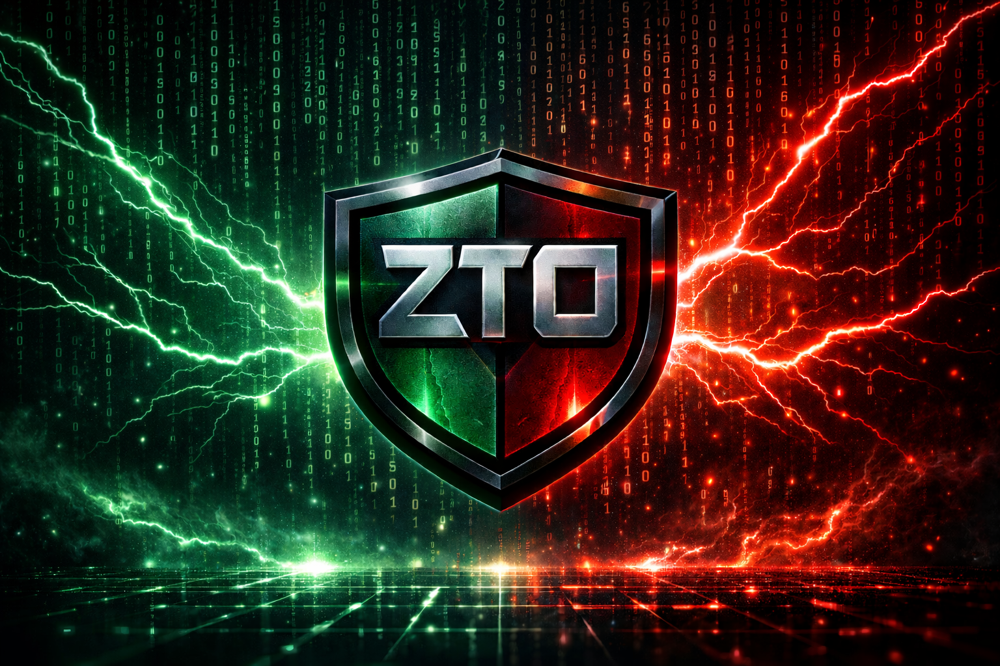

<p align="center">
  
</p>

# ZTO - Zero Friction DTO Validation

Simple and powerful DTO validation for Dart backend applications. Write your DTOs once, get validation and OpenAPI documentation for free.

> 📖 **[Read skill](./SKILL.md)** — agent skill with the conventions, annotations, and production patterns for working with `zto`.

## Features

- **Simple DTOs** — Write DTOs with annotations for validation
- **Automatic Validation** — Type checking + custom validators run at parse time
- **Schema Generation** — Auto-generated schemas with `zto_generator`
- **OpenAPI Ready** — Convert DTOs to OpenAPI 3.0 specs for Swagger/OpenAPI docs
- **Business Rules** — Chain `.refine()` for complex validations
- **Type Safe** — Full type safety with Dart generics

## Ecosystem

`zto` is the core of a three-package toolchain. You write annotated DTOs once and
the companion packages do the rest:

| Package | Role |
|---|---|
| [`zto`](https://pub.dev/packages/zto) | **This package.** Annotations (`@ZDto`, `@ZString`, validators…) + the runtime `Zto.parse()` / `ZtoSchema` validation engine. |
| [`zto_generator`](https://pub.dev/packages/zto_generator) | `build_runner` code generator. Reads your annotated classes and emits the `ZtoSchema` constants (e.g. `$CreateUserDtoSchema`) used at runtime. Run it with `dart run build_runner build`. |
| [`dart_frog_open_api`](https://pub.dev/packages/dart_frog_open_api) | OpenAPI/Swagger spec generator for [Dart Frog](https://dartfrog.vgv.dev). Consumes your `ZtoSchema`s to document routes — see [OpenAPI Integration](#openapi-integration). |

```
@ZDto annotated class
        │  zto_generator (build_runner)
        ▼
  $CreateUserDtoSchema  (ZtoSchema)
        │                         │
        │ zto                     │ dart_frog_open_api
        ▼                         ▼
  Zto.parse() validation    OpenAPI / Swagger docs
```

## Quick Start (3 Steps)

### Step 1: Define Your DTO

Create a file `lib/domain/dtos/user_dto.dart`:

```dart
import 'package:zto/zto.dart';

part 'user_dto.g.dart';  // Generated validation code

@ZDto(description: 'Request to create a user')
class CreateUserDto with ZtoDto<CreateUserDto> {
  @ZString(description: 'User full name', example: 'John Doe')
  @ZMinLength(2)
  @ZMaxLength(100)
  final String name;

  @ZString(description: 'User email address', example: 'john@example.com')
  @ZEmail()
  final String email;

  @ZInt(description: 'User age', example: 25)
  @ZMin(18)
  @ZMax(120)
  final int age;

  @ZString(description: 'Optional phone number')
  final String? phone;  // Nullability from `?` suffix

  const CreateUserDto({
    required this.name,
    required this.email,
    required this.age,
    this.phone,
  });

  factory CreateUserDto.fromMap(Map<String, dynamic> map) {
    return CreateUserDto(
      name: map['name'] as String,
      email: map['email'] as String,
      age: map['age'] as int,
      phone: map['phone'] as String?,
    );
  }
}
```

### Step 2: Generate Schemas

Run the code generator:

```bash
dart run build_runner build
```

This creates `user_dto.g.dart` with the schema constant `$CreateUserDtoSchema`.

### Step 3: Validate in Your Route

```dart
// In your route handler:
final body = await request.json() as Map<String, dynamic>;

try {
  final dto = $CreateUserDtoSchema.parse(body, CreateUserDto.fromMap).refine(
    (d) => d.age < 150,
    field: 'age',
    message: 'Age is unrealistic',
  );

  // dto is now validated and safe to use
  print('User: ${dto.name}, Email: ${dto.email}');
} on ZtoException catch (e) {
  // Handle validation errors
  return Response.json(
    statusCode: 422,
    body: {
      'errors': e.issues
          .map((issue) => {
            'field': issue.field,
            'message': issue.message,
          })
          .toList(),
    },
  );
}
```

Done! You now have:
- ✅ Type validation (string, int, email, etc.)
- ✅ Custom validators (min length, email format, etc.)
- ✅ Null safety
- ✅ Clear error messages

## Class Annotations: `@ZDto`, `@ZEntity`, `@ZModel`

A class becomes a Zto schema by annotating it with one of three **semantically
equivalent** annotations. All three generate the exact same `ZtoSchema` — the
only difference is *intent*, so the annotation documents which layer the type
belongs to:

| Annotation | Use for | Typical layer |
|---|---|---|
| `@ZDto` | Data transfer objects — transport/contract shapes (request & response bodies) | API boundary |
| `@ZEntity` | Domain entities with business rules | Domain |
| `@ZModel` | Persistable aggregates (not necessarily a database table) | Persistence |

They share the same parameters:

| Parameter | Type | Default | Description |
|---|---|---|---|
| `description` | `String` | **required** | Shown in OpenAPI / Swagger UI |
| `parseType` | `ParseType` | `ParseType.camelCase` | How field names map to JSON keys (see below) |
| `deprecated` | `bool` | `false` | Marks the schema as deprecated in OpenAPI |

```dart
@ZDto(description: 'Create user request')
class CreateUserDto with ZtoDto<CreateUserDto> { ... }

@ZEntity(description: 'User domain entity')
class UserEntity with ZtoDto<UserEntity> { ... }

@ZModel(description: 'Persistable user aggregate')
class UserModel with ZtoDto<UserModel> { ... }
```

> Because the three are equivalent, a field whose type is annotated with **any**
> of them is auto-detected as a nested object — no `@ZObject()` needed.

---
## ParseType — Field Name Mapping

`parseType` controls how Dart field names are converted to JSON map keys **when a
field doesn't set an explicit `mapKey`**. Declare it once on the class annotation
and it applies to every field of that class:

| `ParseType` | Transformation | `firstName` becomes |
|---|---|---|
| `camelCase` *(default)* | none — used as-is | `firstName` |
| `snakeCase` | camelCase → snake_case | `first_name` |
| `pascalCase` | uppercases the first letter | `FirstName` |
| `kebabCase` | camelCase → kebab-case | `first-name` |

```dart
@ZDto(description: 'User', parseType: ParseType.snakeCase)
class UserDto with ZtoDto<UserDto> {
  @ZString()
  final String firstName;   // JSON key: first_name

  @ZString()
  final String lastName;    // JSON key: last_name
}
```

**An explicit `mapKey` always wins** over `parseType` inference:

```dart
@ZDto(description: 'User', parseType: ParseType.snakeCase)
class UserDto with ZtoDto<UserDto> {
  @ZString(mapKey: 'email_address')  // overrides snake_case inference
  final String email;                // JSON key: email_address
}
```

---
## Field Types

### Strings

```dart
@ZString(
  description: 'Username',
  example: 'johndoe',
  failMessage: 'Invalid username format',
)
final String username;
```

**Available validators:**
- `@ZMinLength(n)` — String must be at least n characters
- `@ZMaxLength(n)` — String must be at most n characters
- `@ZLength(n)` — String must be exactly n characters
- `@ZEmail()` — Must be a valid email
- `@ZUrl()` — Must be a valid URL
- `@ZRegex(pattern)` — Must match regex pattern
- `@ZPattern(pattern)` — Alias for @ZRegex
---
### Numbers

```dart
@ZInt(description: 'Age', example: 25)
@ZMin(0)
@ZMax(150)
final int age;

@ZDouble(description: 'Price in USD', example: 99.99)
@ZPositive()
final double price;
```

**Available validators:**
- `@ZMin(n)` — Number must be ≥ n
- `@ZMax(n)` — Number must be ≤ n
- `@ZPositive()` — Number must be > 0
- `@ZNegative()` — Number must be < 0
---
### Enums

```dart
enum Status { active, inactive, pending }

@ZEnum()  // Values automatically inferred from enum
final Status status;

// Or explicit:
@ZEnum(values: ['active', 'inactive', 'pending'])
final Status status;
```
---
### DateTime

```dart
@ZDate(
  description: 'Account created date',
  example: '2024-01-01T00:00:00Z',
)
final DateTime createdAt;
```
---
### Nested Objects

```dart
@ZDto(description: 'User address')
class AddressDto {
  @ZString(description: 'Street')
  final String street;
  
  // ...
}

// In parent DTO:
@ZObject()  // Auto-inferred from AddressDto type
final AddressDto address;
```
---
### Lists

```dart
@ZList(
  itemType: AddressDto,
  description: 'List of addresses',
)
final List<AddressDto> addresses;
```
---
## Advanced Usage

### Custom Validation with .refine()

```dart
final dto = $CreateUserDtoSchema.parse(body, CreateUserDto.fromMap)
    .refine(
      (user) => user.age >= 18,
      field: 'age',
      message: 'Must be an adult',
    )
    .refine(
      (user) => !user.email.contains('+'),
      field: 'email',
      message: 'Email aliases not allowed',
    );
```

### Parse Multiple Items

```dart
final users = $CreateUserDtoSchema.parseList(
  jsonArray,
  CreateUserDto.fromMap,
);
```

### Alternate Factories

Use any factory method you want:

```dart
// All work the same way
final dto1 = $CreateUserDtoSchema.parse(data, CreateUserDto.fromMap);
final dto2 = $CreateUserDtoSchema.parse(data, CreateUserDto.fromJson);
final dto3 = $CreateUserDtoSchema.parse(data, CreateUserDto.fromApi);
```

### Error Handling

```dart
try {
  final dto = $CreateUserDtoSchema.parse(body, CreateUserDto.fromMap);
} on ZtoException catch (e) {
  // e.issues contains all validation errors
  for (final issue in e.issues) {
    print('Field: ${issue.field}, Message: ${issue.message}');
  }
}
```
---
## Common Patterns

### Create vs Update DTOs

Use optional fields for update operations:

```dart
@ZDto(description: 'Create a new user')
class CreateUserDto {
  @ZString()
  @ZMinLength(2)
  final String name;
  
  @ZString()
  @ZEmail()
  final String email;
  
  const CreateUserDto({required this.name, required this.email});
}

@ZDto(description: 'Update an existing user')
class UpdateUserDto {
  @ZString()
  @ZMinLength(2)
  final String? name;  // Optional
  
  @ZString()
  @ZEmail()
  final String? email;  // Optional
  
  const UpdateUserDto({this.name, this.email});
}
```

### Response DTOs

```dart
@ZDto(description: 'User response')
class UserResponseDto {
  @ZString(description: 'Unique user ID')
  final String id;
  
  @ZString(description: 'User name')
  final String name;
  
  @ZString(description: 'User email')
  final String email;
  
  @ZDate(description: 'Account creation date')
  final DateTime createdAt;
  
  const UserResponseDto({
    required this.id,
    required this.name,
    required this.email,
    required this.createdAt,
  });
}
```

## Ergonomic Features

### Nullability from Dart's `?` Suffix

Nullability is inferred directly from the Dart `?` type suffix — there is no
annotation for it:

```dart
// This is nullable (optional)
@ZString()
final String? nickname;

// This is required
@ZString()
final String name;
```

### Enum Values Auto-Detection

If you don't specify values, they're read from the enum:

```dart
enum Color { red, green, blue }

@ZEnum()  // Automatically becomes: values: ['red', 'green', 'blue']
final Color color;
```

### Nested DTO Auto-Detection

Fields whose type is annotated with `@ZDto`, `@ZEntity`, or `@ZModel` are automatically treated as objects:

```dart
@ZObject()  // Not needed anymore
final Address address;

// Just use:
final Address address;  // Type is @ZDto, so automatically an object
```

## Testing

```dart
test('validates user creation', () {
  final schema = $CreateUserDtoSchema;
  
  // Valid data passes
  final validUser = schema.parse(
    {'name': 'John', 'email': 'john@example.com', 'age': 25},
    CreateUserDto.fromMap,
  );
  expect(validUser.name, 'John');
  
  // Invalid data throws
  expect(
    () => schema.parse(
      {'name': 'J', 'email': 'invalid', 'age': 15},  // Too short, invalid email, too young
      CreateUserDto.fromMap,
    ),
    throwsA(isA<ZtoException>()),
  );
});
```
---
## OpenAPI Integration

Every `ZtoSchema` can be converted to an OpenAPI 3.0 schema with `DtoToOpenApi`:

```dart
import 'package:zto/zto.dart';

final openApiSchema = DtoToOpenApi.convert($CreateUserDtoSchema);
// Use in your OpenAPI spec builder
```

### With Dart Frog — `dart_frog_open_api`

For [Dart Frog](https://dartfrog.vgv.dev) apps, the
[`dart_frog_open_api`](https://pub.dev/packages/dart_frog_open_api) package does this end-to-end: pass a
`ZtoSchema` straight into its fluent route builder and it generates the full
OpenAPI/Swagger document (request/response bodies, nested DTOs, validators) for
you — no manual schema wiring.

```dart
import 'package:dart_frog_open_api/dart_frog_open_api.dart';

// Describe a route using the zto schema as the request body contract:
Api.path().post((op) => op
    .summary('Create user')
    .body($CreateUserDtoSchema)   // ← your zto schema
    .response(201));
```

Under the hood it calls `DtoToOpenApi.convert` (and `OpenApiSchema.fromZto`) on
the same schemas you already validate with, so your docs never drift from your
validation rules.

## Complete Example

File: `lib/dtos/user_dto.dart`

```dart
import 'package:zto/zto.dart';

part 'user_dto.g.dart';

@ZDto(description: 'Create a new user')
class CreateUserDto with ZtoDto<CreateUserDto> {
  @ZString(description: 'Full name', example: 'Alice Smith')
  @ZMinLength(2)
  final String name;

  @ZString(description: 'Email address', example: 'alice@example.com')
  @ZEmail()
  final String email;

  const CreateUserDto({
    required this.name,
    required this.email,
  });

  factory CreateUserDto.fromMap(Map<String, dynamic> map) {
    return CreateUserDto(
      name: map['name'] as String,
      email: map['email'] as String,
    );
  }
}
```

File: `lib/routes/users.dart`

```dart
import 'package:dart_frog/dart_frog.dart';
import 'package:myapp/dtos/user_dto.dart';

Future<Response> onRequest(RequestContext context) async {
  if (context.request.method == HttpMethod.post) {
    final body = await context.request.json();
    
    try {
      final newUser = $CreateUserDtoSchema.parse(
        body as Map<String, dynamic>,
        CreateUserDto.fromMap,
      );
      
      // Save to database
      return Response.json(
        statusCode: 201,
        body: {'id': '123', 'name': newUser.name, 'email': newUser.email},
      );
    } on ZtoException catch (e) {
      return Response.json(
        statusCode: 422,
        body: {
          'errors': e.issues
              .map((i) => {'field': i.field, 'message': i.message})
              .toList(),
        },
      );
    }
  }
  
  return Response(statusCode: 405);
}
```

## FAQ

**Q: Do I need to write `fromMap`?**  
A: Yes, you write the deserialization logic yourself. ZTO only handles validation.

**Q: Can I use ZTO with JSON serialization?**  
A: Yes! Use any factory method (`fromMap`, `fromJson`, `fromApi`, etc.). ZTO validates the same way.

**Q: What if my API uses snake_case but Dart uses camelCase?**  
A: Use `@ZDto(parseType: ParseType.snakeCase)` on the class to auto-convert.

**Q: How do I handle optional fields?**  
A: Use Dart's `?` suffix:
```dart
@ZString()
final String? nickname;  // Optional field
```

**Q: Can I validate across multiple fields?**  
A: Yes, use `.refine()`:
```dart
final dto = $DtoSchema.parse(data, Dto.fromMap)
    .refine((d) => d.password == d.confirmPassword, message: 'Passwords must match');
```

## Performance

- **Code generation**: Run once with `dart run build_runner build`
- **Runtime**: Validation is O(n) where n = number of fields
- **No reflection**: Everything is compiled ahead of time

## Production Recommendations

In production, **never let validation details reach the client.** The `issues`
inside a `ZtoException` expose your internal field names, map keys, and business
rules — that's information disclosure that helps an attacker probe your API.
Treat the detailed `ZtoException` as a **backend-only** signal: it should flow
exclusively to your logs / analytics, never into the HTTP response body.

**Rule of thumb:** the client always gets the same **generic** error message; the
full detail goes only to your observability pipeline.

```dart
import 'dart:io';
import 'package:dart_frog/dart_frog.dart';
// import your logger (talker) / analytics client

Future<Response> onRequest(RequestContext context) async {
  final body = await context.request.json() as Map<String, dynamic>;

  try {
    final dto = $CreateUserDtoSchema.parse(body, CreateUserDto.fromMap);
    // ... use dto
    return Response.json(body: {'ok': true});
  } on ZtoException catch (e, stack) {
    // ✅ Detailed issues go ONLY to logs / analytics — never to the client.
    talker.warning('Validation failed', e, stack);
    analytics.track('validation_failed', {
      'route': context.request.uri.path,
      'issues': e.issues.map((i) => i.toMap()).toList(),
    });

    // ✅ Client receives a generic message with no internal detail.
    return Response.json(
      statusCode: HttpStatus.unprocessableEntity, // 422
      body: {'message': 'Invalid request.'},
    );
  }
}
```

**Do**
- Return one fixed, generic message (e.g. `'Invalid request.'`) for every
  validation failure.
- Forward `e.issues` (or `e.toMap()`) only to logs / analytics on the backend.
- Use a single shared error handler / middleware so no route accidentally leaks
  `issues`.

**Don't**
- Serialize `e.issues` / `e.toMap()` into the response sent to the client.
- Echo back field names, regex patterns, or the offending value.
- Configure `Zto.errorFormatter` to build a *client-facing* payload from
  `issues` — keep that formatter for your internal logging only.

> The defaults (`ZtoException.toMap()` / `_defaultFormat`) include the full
> `errors` list precisely so you can pipe it to logging. Make the conscious
> choice to strip it before responding to the client.

## License

MIT
